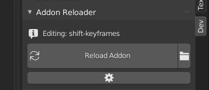

# Addon Reloader
A quick reloader for addon development inside Blender.

### How to use
The addon works in the ``Dev`` panel inside the **Text Editor**
You only need to locate your addon's filepath, and then it should be set.

### Disclaimer
This is a core functionality of a *suite* of sorts I'm working on. I probably won't update this particular addon until I release the bundled version, which will probably get more quality-of-life features. 

As it stands, it's perfectly (mostly) functional for what it seeks to do.

